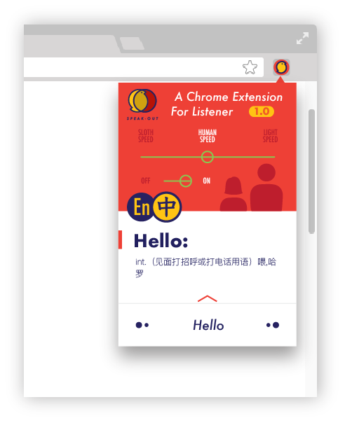

# Speak-Out

** Version 1.1.0 **

## A Brief Introduction about Speak-Out (Watch Here👀!!)
https://www.youtube.com/watch?v=y24Rw-SWyMI

## Why?

- Did you ever feel that you can absorb more information by listening someone's speaking than read by yourself?

- Did you ever struggle to copy some unknown words on the browser & paste in another tab to figure out its meaning?

## Description

Speak-Out is a small tool that fixs those questions above & helps you to have a smoother 🏄‍♀️🏄🏼 experience.

## How To Use?

Since it is a Chrome Extension. I need you to have a Google Chrome 1st.

Your can install this extension in Chrome store here: https://chrome.google.com/webstore/detail/speak-out/pncollhcmilogpggdbibckiolebhnafl?hl=en

If you want to check the code, there is no npm install required. Just download it & go to your Chrome Broswer.

In Chrome Broswer--Window--Extensions--Load Unpacked--locate the download file--Select--Enjoy!🍻

## App Screen Shoot 

## Useful Tech

- Speech Synthesis https://developer.mozilla.org/en-US/docs/Web/API/SpeechSynthesis

- ShanBay API https://www.shanbay.com/help/developer/api_v1/

- Google Chrome Storage https://developer.chrome.com/apps/storage

- HTML, CSS, JS, JQuery

